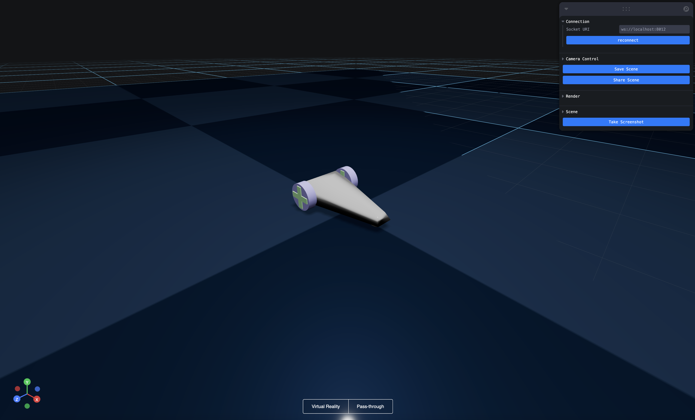
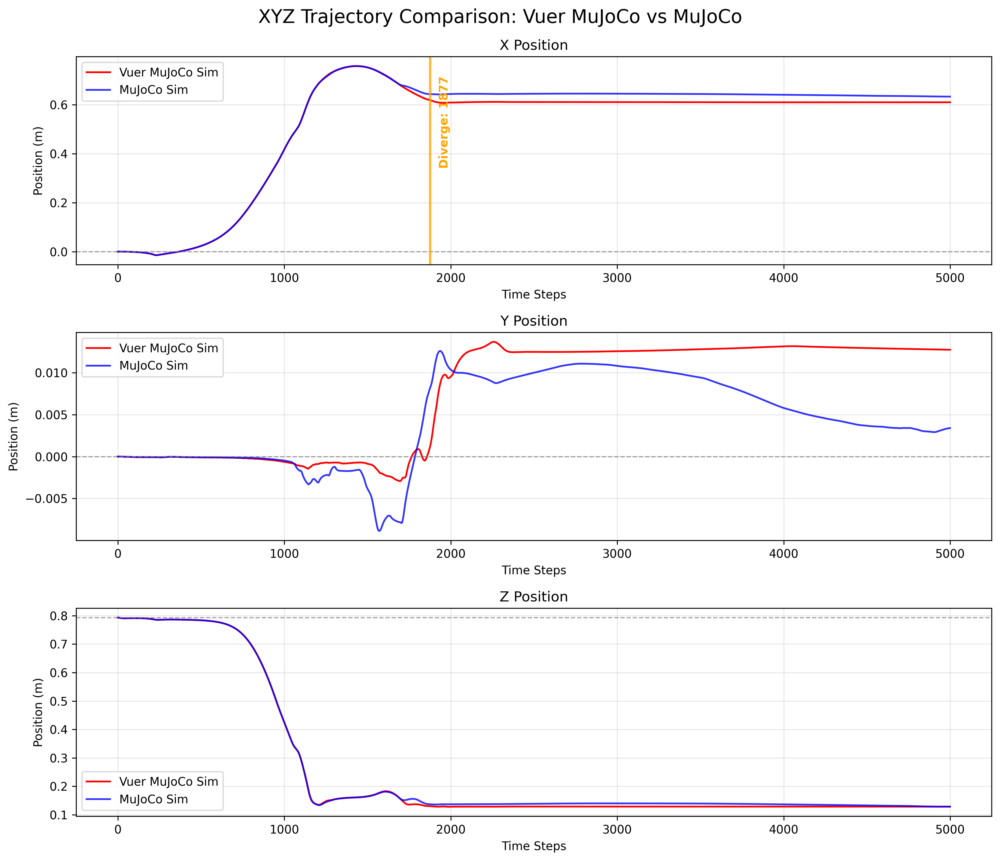
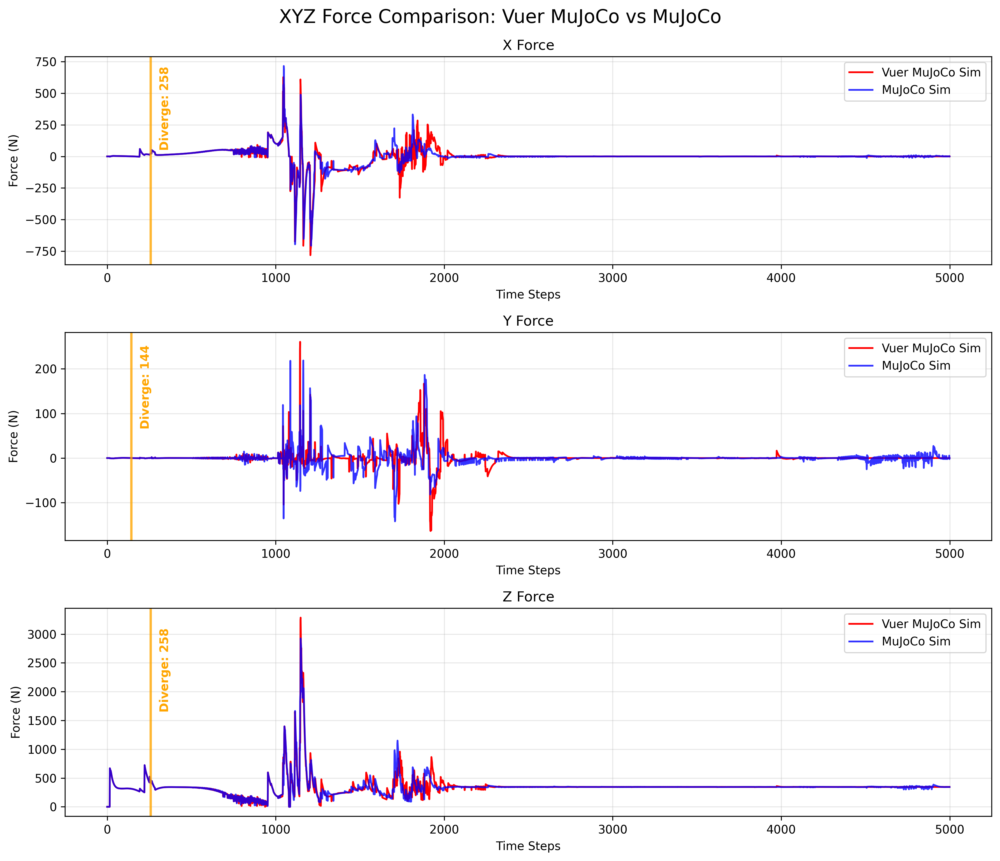

# Vuer Sim Example


## Overview

Simulation environment for robotic policies using MuJoCo and Vuer. Provides synchronous interface over Vuer's async operations.

Features:
- Synchronous control interface
- Web-based 3D visualization
- Data recording and analysis tools
- Modular env/task/sim structure

## Installation

```bash
git clone <repository-url>
cd vuer-sim-example
pip install -r requirements_simple.txt
```

## Usage

### FALCON Policy Example

Run G1 humanoid with FALCON policy:

```bash
python examples/falcon_policy_example.py
```

Open http://localhost:8012 to view simulation.



### Car Control Example

Gamepad-controlled car:

```bash
python examples/car_control_gamepad.py
```

Open http://localhost:8012 and connect gamepad.

## Data Recording

### MuJoCo Simulation Recording

Record simulation data from pure MuJoCo (no policy):

```bash
# Record 1000 steps to CSV (qpos only)
python examples/mujoco_sim.py --xml mjcf_models/scene_g1_29dof_freebase.mjcf.xml --file output.csv --steps 1000

# Record all keyframe data to NPZ
python examples/mujoco_sim.py --xml mjcf_models/scene_g1_29dof_freebase.mjcf.xml --file output.npz --npz --steps 500
```

### Vuer Policy Recording

Record data while running a policy:

```bash
# Record FALCON policy execution
python examples/vuer_mujoco_sim.py --xml mjcf_models/scene_g1_29dof_freebase.mjcf.xml --file policy_data.npz --npz --steps 1000
```

## Analysis & Plotting

Generate plots from recorded data:

```bash
# Plot G1 XYZ positions
python examples/plot_xyz.py

# Plot forces
python examples/plot_xyz_forces.py

# Plot trajectories
python examples/plot_xyz_trails.py
```

Plots saved to `examples/plots/`:





## Repository Structure

```
vuer_sim_example/
├── envs/          # Environment wrappers
├── tasks/         # Task definitions
├── policies/      # Policy implementations
└── sim/           # Simulation backends

examples/
├── mjcf_models/   # Robot model files
├── policies/      # Pre-trained policy files
├── plots/         # Generated analysis plots
└── *.py           # Example scripts
```

## Sim2Sim Validation

Compare simulations:
- Pure MuJoCo (`mujoco_sim.py`)
- Policy-driven (`vuer_mujoco_sim.py`)
- Different solvers (RK4 vs CG)

Use plotting scripts to validate deployment behavior.