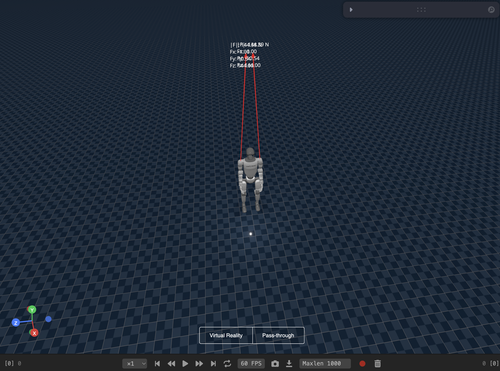

# Vuer Deployment Sim

Deploy any whole-body control policy in the Vuer simulator with Unitree SDK integration.



## Quick Setup

```bash
# Create environment
conda create -n vuer python=3.8 && conda activate vuer
pip install -U 'vuer[all]'
conda install pinocchio=3.2.0 -c conda-forge

# Install Unitree SDK
git clone https://github.com/unitreerobotics/unitree_sdk2_python.git
cd unitree_sdk2_python && pip install -e .

# Install this package
cd vuer-deployment-sim && pip install -e .
```

## Run FALCON Example

**Terminal 1 - Simulator:**
```bash
python sim2real/sim_env/loco_manip_vuer.py --config=config/g1/g1_29dof_falcon.yaml
```
Controls: `7` drop elastic band, `8` increase, `9` disable

**Terminal 2 - Policy:**
```bash
python rl_policy/loco_manip/loco_manip.py \
  --config=config/g1/g1_29dof_falcon.yaml \
  --model_path=models/falcon/g1_29dof.onnx
```

## Add Your Own Policy

1. Extend `sim2real/rl_policy/base_policy.py`
2. Create config in `sim2real/config/`
3. Export model to ONNX format
4. Run with same pattern as FALCON

## Structure

- `config/` - YAML configurations
- `models/` - ONNX policy models
- `rl_policy/` - Policy implementations
- `sim_env/` - Vuer simulation environments
- `utils/comm/` - Unitree SDK communication layer